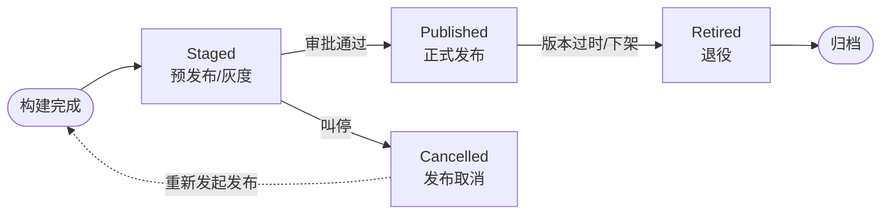

# release 子命令设计

`release` 子命令管理软件版本从**预发布**到**退役**的完整生命周期。包含 4 个原子命令：`stage`、`publish`、`cancel`、`retire`。

---

## 生命周期流程



---

## 状态与命令

| 命令 | 状态 | 时机 | 结果 |
|------|------|------|------|
| **`stage`** | 过渡态（Staged） | 构建完成，**准备发布** | 部署到预发布/灰度环境，待审批或验证 |
| **`publish`** | 终态（Published） | 审批通过，**正式上线** | 版本对用户可见，提供服务，记录为一次有效发布 |
| **`cancel`** | 终态（Cancelled） | **发布过程中**发现问题，紧急叫停 | 本次发布尝试终止，环境回滚 |
| **`retire`** | 终态（Retired） | **上线后**版本过时、有严重缺陷或不再维护 | 版本**已下线**，停止服务，但保留历史记录 |

---

## 版本号规范

`release` 命令操作的最小单位是**版本**，需提前明确版本号规则。

### 格式

遵循 [SemVer](https://semver.org/)：`MAJOR.MINOR.PATCH`，可选预发布后缀。

### 示例

```
kcli release stage 1.2.3
kcli release stage 1.2.3-rc.1
kcli release publish 1.2.3
kcli release cancel 1.2.3
kcli release retire 1.2.3
```

### 约束

- **预发布后缀**：支持 `-alpha.N`、`-beta.N`、`-rc.N` 等，用于正式发布前的验证阶段。
- **版本递增**：由上层 CI 流水线或开发者决定，`release` 命令不做自动递增。
- **唯一性**：同一版本号 `publish` 成功后不可再次 `publish`；若需重新发布，必须递增版本号。
- **不可变性**：`publish` 成功后，版本内容（制品、Changelog 等）不可修改。

---

## 关键边界

### cancel 的语义

`cancel` 终止的是**当次发布任务**，而非版本号本身。同一个版本号可以多次执行 `stage → cancel`，直到 `publish` 成功为止：

```
kcli release stage 1.2.3      # 第一次尝试
kcli release cancel 1.2.3     # 叫停，状态 = Cancelled
kcli release stage 1.2.3      # 重新发起，生成新的发布记录
kcli release publish 1.2.3    # 正式上线
```

- `cancel` **只能**在 `publish` 成功之前执行（即从 `Staged` 跳转）。
- 一旦 `publish` 完成，不可取消，只能走 `retire` 下线。

### retire 的语义

- **软删除**：数据永远保留，满足审计和回查需求。
- **不可逆**：退役后不能重新上线；如需修复，走 hotfix 流程（见下文）。

### stage → publish 是单向门

发布成功后无法回退到 `Staged`。如需修复已发布的版本，必须递增版本号发起新的发布流程。

---

## 灰度发布（计划中）

`[planned]` v1 版本中 `stage` 仅做单步部署到预发布环境，不做流量控制。

v2 版本计划扩展 `stage` 命令以支持分批灰度：

```
kcli release stage 1.3.0 --ratio 0.1    # 灰度 10% 流量
kcli release stage 1.3.0 --ratio 0.5 --promote  # 提升至 50%
kcli release stage 1.3.0 --ratio 1.0    # 全量，准备 publish
```

当前文档预留此扩展点，实现时再细化。

---

## Hotfix 说明

`release` 命令不提供独立的 hotfix 子命令。Hotfix 作为**上层编排流程**处理：

1. 基于退役版本 `1.2.3` 创建修复分支，修复后生成新版本 `1.2.4`。
2. `1.2.4` 走标准 `stage → publish` 流程。
3. 旧版本 `1.2.3` 状态保持 `Retired` 不变。

这样 `release` 命令保持原子性和纯粹性，hotfix 的编排逻辑由 CI/CD 流水线或开发者自行处理。
