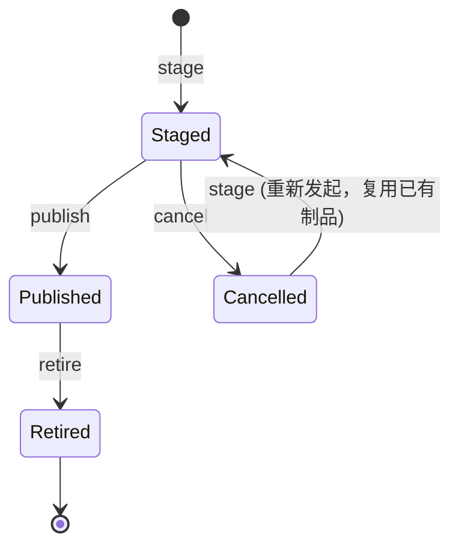

# 软件发布生命周期管理蓝图

本蓝图是 `platform/cli/release.md` 的上层规范，任何具体 CLI 实现均应遵循此契约。

## 1. 背景与目标

在持续交付体系中，一个版本从构建完成到最终退役，需要经历一系列严格受控的状态变更。本蓝图定义一套与具体工具无关的**发布生命周期模型、命令语义、状态机及约束**，旨在：

- 保证发布过程的**可追溯性与合规性**
- 消除 `delete` 等危险操作，强制使用状态驱动的生命周期
- 提供清晰的**单向门**和**异常恢复路径**
- 保持底层命令的**原子性**，由上层编排实现复杂流程

## 2. 核心概念

- **发布单元**：以语义化版本号标识的不可变制品集合（二进制包、镜像、配置等）。
- **发布尝试**：一次从预发布到正式上线或被取消的独立过程。一个版本可有多轮尝试，但最多只有一次成功。
- **发布尝试 ID**：由 `stage` 命令生成的唯一标识，用于关联一次完整的发布尝试。其生命周期始于 `stage`，终于 `publish` 或 `cancel`，是审计追踪的主键。
- **状态**：发布单元在其生命周期中所处的阶段，包括 `Staged`、`Published`、`Cancelled`、`Retired`。
  - `Staged` 状态可包含实现层定义的子状态（如灰度比例、分批进度）。子状态的变化不触发顶层状态机转换，也不影响 `publish` 或 `cancel` 的准入条件。
- **原子命令**：直接作用于状态转换的最小操作，无副作用，无编排逻辑。

## 3. 版本规范

所有发布单元**必须**遵循 [Semantic Versioning 2.0.0](https://semver.org/)。

- **格式**：`MAJOR.MINOR.PATCH[-PRERELEASE][+BUILD]`
- **预发布标识**：`-alpha.N`、`-beta.N`、`-rc.N` 等
- **唯一性约束**：一个版本号一旦进入 `Published` 状态，不得再次执行 `publish`；需发布修复时必须递增版本号。
- **内容不可变**：版本关联的所有制品和元数据在首次确定后不可修改。

## 4. 状态机与生命周期

- `Cancelled` 状态下可重新执行 `stage`，生成一次新的发布尝试。`stage` 的前提是制品已构建完成且可用；`Cancelled` 状态的版本重新 `stage` 时复用该版本已有制品，无需重新构建。
- `Published` 是**单向门**，无法退回到 `Staged` 或 `Cancelled`。
- `Retired` 是最终稳定态，代表版本已停止服务但记录永久保留。

## 5. 命令契约

### 5.1 `stage <version>`
- **作用**：将指定版本部署至预发布/灰度环境，进入 `Staged` 状态。
- **前置条件**：版本不存在于 `Published` 状态；**其他**版本是否处于 `Staged` 状态不构成阻塞（同一版本的重复 `stage` 视为刷新部署，予以放行）。
- **并发限制**：是否允许多个版本同时处于 `Staged` 状态由实现层定义，蓝图不做硬性约束。
- **幂等性**：同一版本在 `Staged` 状态下重复执行应视为刷新部署（如重启、重新同步），不产生新的发布尝试记录。
- **输出**：发布尝试 ID（非版本号），用于审计追踪。

### 5.2 `publish <version>`
- **作用**：将当前 `Staged` 的版本正式发布上线，进入 `Published` 状态。
- **前置条件**：版本必须处于 `Staged` 状态，且通过所有必须的审批门禁。
- **结果**：
  - 版本状态变为 `Published`，向用户提供服务。
  - 触发不可逆记录，审计日志持久化。
  - 返回本次发布尝试 ID。
- **不可逆**：一旦成功，不可 `cancel` 或回退到 `Staged`。

### 5.3 `cancel <version>`
- **作用**：终止当前进行中的发布尝试，版本进入 `Cancelled` 状态，并触发环境回滚。
- **前置条件**：版本处于 `Staged` 状态。
- **回滚行为**：预发布环境恢复到此次尝试前的状态（由实现层保证）。
- **可恢复**：`Cancelled` 后仍可对同一版本重新执行 `stage`。
- **输出**：返回本次发布尝试 ID。

### 5.4 `retire <version>`
- **作用**：将已上线的版本标记为退役，进入 `Retired` 状态，停止对外服务。
- **前置条件**：版本处于 `Published` 状态。
- **结果**：
  - 服务下线，但所有发布记录、制品引用永久保留（软删除）。
  - 不再接受流量或调用。
- **不可逆**：退役后版本无法直接重新上线；必须通过 hotfix 流程发布新版本。

## 6. 扩展场景编排

### 6.1 Hotfix（热修复）
不属于原子命令，定义为**上层编排流程**：

1. 基于已 `Retired`（或 `Published`）版本对应的源代码标签创建修复分支。
2. 修复后生成递增的补丁版本（如 `1.2.3` → `1.2.4`）。
3. 执行标准 `stage → publish` 流程完成上线。
4. 旧版本状态保持不变。

### 6.2 灰度发布（未来扩展）
可在 `stage` 命令中增加流量比例参数，例如 `stage 1.3.0 --ratio=0.1`。这仍然是 `Staged` 状态的子状态，不影响顶层生命周期。所有灰度步骤完成后才允许 `publish`。

## 7. 安全与审计约束

- **不可删除**：物理删除命令在发布系统中被禁止。所有版本及发布尝试记录均为追加写入，不可修改或销毁。
- **角色分离**（建议）：

  | 命令 | 建议角色 | 备注 |
  |------|----------|------|
  | `stage` | 开发者、CI 系统 |  |
  | `cancel` | 发布管理员、自动化回滚策略 | 应实施二次确认或独立审批，降低误操作风险 |
  | `publish` | 发布管理员、审批门禁 |  |
  | `retire` | 产品负责人、SRE |  |

- **事件溯源**：所有状态变更均作为事件持久化，可供查询和回溯。

## 8. 工具实施指南

本蓝图不绑定特定 CLI 或平台。实施时只需：

1. 将状态枚举映射到数据库或配置中心。
2. 将命令实现为 HTTP API、RPC 或 CLI 动作。
3. 严格执行前置条件校验和状态转换规则。
4. 保留完整的不可变审计日志。
5. **审计字段**：每次状态转换必须记录操作人、时间戳、版本号、发布尝试 ID、旧状态、新状态、操作原因（必填）。
6. **幂等性实现**：`stage` 在版本已处于 `Staged` 状态时，应执行刷新部署动作但不产生新的发布尝试记录。

任何符合上述契约和约束的系统即可认为是与本蓝图兼容的发布管理系统。
